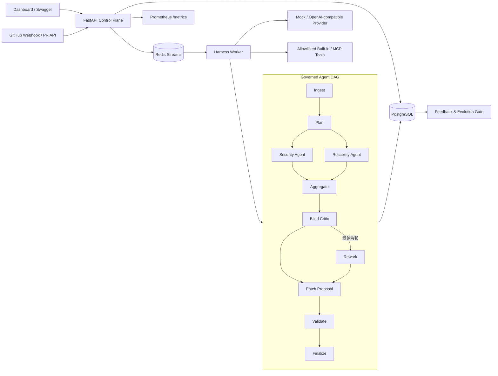

# PR Governance Multi-Agent Harness

[](https://github.com/hwwwei/pr-governance-harness/actions/workflows/ci.yml)
[](https://www.python.org/)
[](https://fastapi.tiangolo.com/)
[](LICENSE)

面向 Pull Request 合并前安全与可靠性治理的 Multi-Agent Harness。

它将一次 PR 审查组织成可恢复、可审计、受预算和权限约束的 DAG：规划器并行委派 Security / Reliability Agent，Blind Critic 对匿名化发现做独立复核，随后生成只读候选补丁并执行安全校验。系统保留完整 Run Trace、Checkpoint、反馈记忆和版本化演进记录。

## 设计目标

单次 LLM Code Review 容易出现结论不稳定、工具越权、失败不可恢复和效果无法量化等问题。本项目把重点放在模型之外的 Harness 层：

- 谁可以调用什么工具，以及失败后能否安全重试；
- 多个 Agent 如何并行协作，又如何避免相互强化同一个误判；
- 一次运行如何被追踪、恢复、取消和复盘；
- Prompt / Skill 更新如何经过 Validation 与 Holdout 非退化门禁；
- 没有外部模型密钥时，如何稳定离线运行并在 CI 中回归。

## 核心能力

- 提交 unified diff，异步创建风险分析 Run；
- 查看 DAG 节点、重试次数、耗时、Checkpoint、预算和完整 Trace；
- Security / Reliability Agent 并行分析，Blind Critic 不接收 Agent 身份；
- 输出 Finding、风险等级、候选 unified diff 和校验结果；
- 通过 GitHub webhook 或仓库名 + PR 编号拉取公开/授权 PR；
- 运行 20 条固定 Validation / Holdout Benchmark；
- 提交误报、漏报和失败反馈，形成仓库级 Memory Pattern；
- 生成、激活和回滚 Prompt / Skill 候选版本；
- 使用 Prometheus 观察运行量、节点耗时、重试、模型调用和风险分布。

## 系统架构



### 一次 Run 的治理语义

| 阶段 | 作用 | 治理点 |
| --- | --- | --- |
| Ingest / Plan | 解析变更文件并选择执行角色 | 输入大小限制、预算初始化 |
| Security / Reliability | 并行检查安全与可靠性风险 | 角色级 Tool 白名单、模型超时 |
| Aggregate | 按 fingerprint 合并发现 | 幂等去重 |
| Blind Critic | 独立复核证据和置信度 | 隐藏来源 Agent，减少确认偏差 |
| Rework | 将 Critic 返工请求交回原 Agent，重新补充证据 | 最多两轮，防止无限反思 |
| Patch / Validate | 生成只读候选补丁 | 禁止 push，拦截危险内容 |
| Finalize | 写入报告和最终 Checkpoint | Trace 可查询、失败可续跑 |

## 技术栈

- Python 3.12、FastAPI、Pydantic v2
- SQLAlchemy 2、Alembic、PostgreSQL
- Redis Streams Consumer Group
- OpenAI-compatible Provider、确定性 Mock Provider
- MCP-ready Tool Adapter、最小权限 Tool Registry
- `unidiff` 统一 Diff 解析与候选补丁静态校验
- Prometheus、Docker Compose、GitHub Actions
- 原生 JavaScript Dashboard，无前端构建链

## 运行一次完整分析

可以在 Dashboard 粘贴 Diff，也可以调用 API：

```bash
curl -X POST http://localhost:8000/api/v1/runs \
  -H "Content-Type: application/json" \
  -d '{
    "repository": "acme/payment-service",
    "pr_number": 42,
    "diff": "diff --git a/src/runner.py b/src/runner.py\n--- a/src/runner.py\n+++ b/src/runner.py\n@@ -1,0 +1,2 @@\n+import subprocess\n+subprocess.run(command, shell=True)\n"
  }'
```

接口立即返回 `run_id`。随后查询：

```bash
curl http://localhost:8000/api/v1/runs/<run_id>
```

最终报告包含：

```json
{
  "status": "completed",
  "risk_level": "high",
  "findings": [
    {
      "type": "command_injection",
      "severity": "high",
      "file": "src/runner.py",
      "evidence": "subprocess.run(command, shell=True)",
      "confidence": 0.94
    }
  ],
  "patch": {
    "validation": {
      "valid": true,
      "parseable": true,
      "scope_allowed": true,
      "safe": true,
      "tests_not_executed": true
    }
  },
  "trace_id": "<run_id>"
}
```

也可以直接运行端到端 Smoke Test：

```bash
python scripts/smoke_test.py
```

## 核心 API

| 方法 | 路径 | 说明 |
| --- | --- | --- |
| `POST` | `/api/v1/runs` | 提交 unified diff，创建异步 Run |
| `GET` | `/api/v1/runs` | 查询最近运行 |
| `GET` | `/api/v1/runs/{id}` | 查询报告、节点、预算、Checkpoint 和 Trace |
| `GET` | `/api/v1/runs/{id}/events` | 通过 SSE 获取运行状态 |
| `POST` | `/api/v1/runs/{id}/cancel` | 取消运行 |
| `POST` | `/api/v1/runs/{id}/resume` | 从失败或取消状态恢复，可提交预算上调对象 |
| `POST` | `/api/v1/runs/{id}/feedback` | 回流误报、漏报或失败轨迹 |
| `POST` | `/api/v1/github/webhook` | 验证签名、按 `X-GitHub-Delivery` 去重并接收 PR 事件 |
| `POST` | `/api/v1/github/runs` | 按仓库和 PR 编号拉取 Diff |
| `POST` | `/api/v1/benchmarks/evaluate` | 执行固定 Benchmark |
| `GET/POST` | `/api/v1/evolution/*` | 查询、生成、激活和回滚候选版本 |
| `GET` | `/metrics` | Prometheus 指标 |

## 配置

复制 `.env.example` 为 `.env`，常用配置如下：

| 环境变量 | 默认值 | 说明 |
| --- | --- | --- |
| `DATABASE_URL` | `sqlite:///./harness.db` | SQLAlchemy 数据库连接 |
| `REDIS_URL` | `redis://localhost:6379/0` | Redis Stream 地址 |
| `RUN_IN_PROCESS` | `true` | 本地模式是否在 API 进程消费任务 |
| `MODEL_PROVIDER` | `mock` | `mock` 或 `openai-compatible` |
| `MODEL_BASE_URL` | 空 | Compatible API Base URL |
| `MODEL_NAME` | `default-model` | 模型名称 |
| `MODEL_API_KEY` | 空 | 模型 API Key |
| `GITHUB_TOKEN` | 空 | 拉取私有 PR 时使用的只读 Token |
| `GITHUB_WEBHOOK_SECRET` | 空 | GitHub webhook HMAC-SHA256 密钥 |
| `AUTO_ACTIVATE_EVOLUTION` | `true` | 门禁通过后是否自动激活候选版本 |

真实模型示例：

```env
MODEL_PROVIDER=openai-compatible
MODEL_BASE_URL=https://your-provider.example/v1
MODEL_NAME=your-model
MODEL_API_KEY=your-key
```

## Benchmark 与受控演进

项目内置 `benchmark/cases.json` 中 20 条可审阅的确定性样例，覆盖 Python / JavaScript 中的安全问题、可靠性问题、混合问题和 Clean PR，并固定划分 Validation / Holdout。

- Validation 与 Holdout 固定隔离；
- Provider Benchmark 运行规则/模型层检测，计算 Precision、Recall、F1、高风险 Recall 和 Clean PR Specificity；
- 完整 Runtime、Redis、数据库链路由 `scripts/smoke_test.py` 和 Compose CI 单独验证；
- 指标由实际检测结果计算，不写死在 README；
- 候选版本只有在关键指标均不退化且至少一项提升时才通过门禁；
- 激活只改变后续 Run 使用的版本化 Prompt / Skill 配置，不修改程序源码；
- 每次候选、评测、激活和回滚都会保留数据库记录。

执行：

```bash
curl -X POST http://localhost:8000/api/v1/benchmarks/evaluate
```

## 可观测性与可靠性

- `NodeExecution` 使用 `(run_id, node, attempt)` 唯一约束保证落库幂等，Run 使用数据库租约防止重复执行；
- 节点状态、耗时、错误、输出和重试次数写入 PostgreSQL；
- 每个阶段完成后更新 Checkpoint；
- Redis Consumer 只有在 Run 执行结束后 ACK；Worker 崩溃时消息留在 Pending Entries List，由 `XAUTOCLAIM` 接管；
- Prometheus 暴露运行量、活跃 Run、节点耗时、重试、模型调用、预算和 Finding 分布；
- Mock Provider 保证 CI 不依赖外部模型服务，也不会因模型随机性产生偶发失败。

## 安全边界

- GitHub Token 仅用于读取 PR，不提交代码、不创建分支、不回写评论；
- Agent 只能调用角色白名单中的 Tool；
- 未显式注册的 MCP Server / Tool 默认拒绝；当前 MCP 是进程内 MCP-ready 权限边界，不包含远程 MCP transport；
- 候选补丁只作为报告内容返回；
- Runtime 不提供任意 Shell Tool，也不执行 PR 中的代码；
- Webhook 使用 `X-Hub-Signature-256` 做 HMAC 校验。

更完整的威胁模型和部署边界见 [SECURITY.md](SECURITY.md)。

## 项目结构

```text
app/
├── main.py          # FastAPI、Dashboard、GitHub 与管理 API
├── runtime.py       # DAG Runtime、预算、重试、Checkpoint、Trace
├── providers.py     # Mock / OpenAI-compatible Provider 与结构化输出校验
├── diffs.py         # 统一 Diff 解析、行号映射和 Patch 校验
├── stream.py        # Redis Streams 发布、消费、ACK、XAUTOCLAIM
├── tools.py         # Tool Registry 与 MCP 权限边界
├── models.py        # SQLAlchemy 持久化模型
├── benchmark.py     # Provider Benchmark 与指标计算
└── evolution.py     # 反馈聚类、候选版本、门禁和回滚
migrations/          # Alembic 基线迁移
scripts/             # 本地验证与端到端 Smoke Test
benchmark/cases.json # 可审阅的 20 条固定样例
tests/               # Runtime、API、Provider、权限、签名和门禁测试
.github/workflows/   # Python 与 Docker Compose CI
```

## 测试与 CI

```bash
python -m pip install -e ".[dev]"
python -m compileall -q app migrations tests
pytest
```

GitHub Actions 会执行多层验证：

1. Python 3.12 源码编译、Ruff、单元/API 测试、FastAPI 启动和端到端 Run；
2. Docker Compose 构建，真实启动 PostgreSQL、Redis、API、Worker 和 Prometheus，并验证 Redis Worker 完成一次 Run；
3. 失败路径测试覆盖预算、取消、Resume、重复 Webhook 和消息重投语义。

## 部署边界

- 默认 Mock Provider 用于确定性回归；接入真实模型后，应使用目标仓库的代表性数据集重新评估；
- 当前部署模型面向可信网络内的单租户环境，不包含终端用户鉴权和租户隔离；
- MCP Adapter 提供注册和权限边界，远程 MCP transport 由部署方按需接入；
- Patch Validator 只检查 Diff 结构、变更范围和危险内容，不执行不可信代码，报告中会明确标记 `tests_not_executed=true`；
- Cancel 采用协作式取消，正在进行的同步 Provider 调用会在当前节点结束后停止；
- Benchmark 是固定的回归数据集，不替代面向实际代码分布的独立评测。

## License

[MIT](LICENSE)
